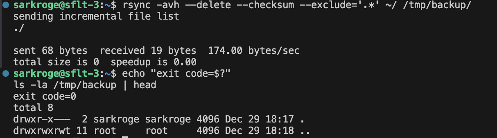
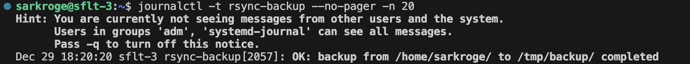
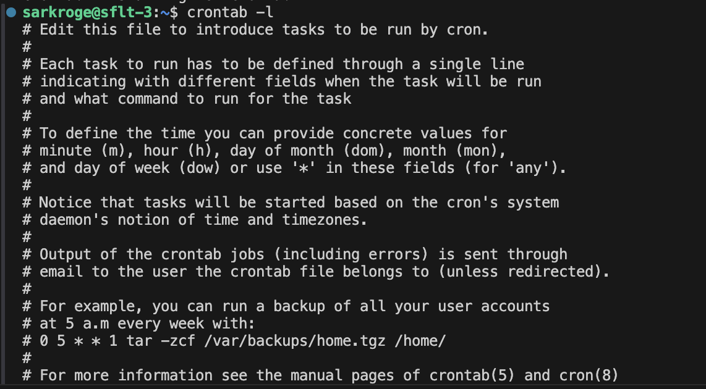

# Домашнее задание к занятию 3 «Резервное копирование»

**Студент:** Краснов Егор

---

## Цель задания
В результате выполнения задания были освоены:
1. Создание зеркальной резервной копии с помощью `rsync`
2. Настройка регулярного резервного копирования с использованием `cron`
3. Логирование результатов выполнения резервного копирования

---

## Используемая инфраструктура

- Облачная платформа: **Yandex Cloud**
- Виртуальные машины: **2 ВМ**
  - `vm1` - основная, на которой выполнялось домашнее задание
  - `vm2` - дополнительная ВМ с другим IP-адресом
- Операционная система: **Ubuntu**

---

## Задание 1

### Условие
Составить команду `rsync`, которая:
- создаёт зеркальную копию домашней директории пользователя в `/tmp/backup`;
- исключает из синхронизации все скрытые директории (начинающиеся с точки);
- выполняет сравнение файлов по хэш-суммам;
- результат выполнения предоставить в виде скриншота.

### Решение

```bash
rsync -avh --delete --checksum --exclude='.*' ~/ /tmp/backup/
```

**Пояснения к ключам:**
- `-a` - архивный режим (сохраняет права, владельца, время модификации);
- `-v` - подробный вывод;
- `-h` - удобочитаемый вывод;
- `--delete` - удаляет файлы в директории назначения, отсутствующие в источнике (зеркало);
- `--checksum` - сравнение файлов по хэш-суммам;
- `--exclude='.*'` - исключение скрытых файлов и директорий.

### Скриншот



---

## Задание 2

### Условие
- Написать скрипт резервного копирования с использованием `rsync`;
- настроить ежедневный запуск с помощью `cron`;
- резервная копия должна быть зеркальной;
- резервная копия размещается локально в `/tmp/backup`;
- результат выполнения должен логироваться в системный журнал;
- предоставить файл `crontab` и скриншот с результатом работы.

---

### Скрипт резервного копирования

Файл: `/usr/local/bin/home_backup.sh`

```bash
#!/usr/bin/env bash
set -euo pipefail

SRC="/home/$USER/"
DST="/tmp/backup/"
TAG="rsync-backup"

mkdir -p "$DST"

if rsync -a --delete --checksum --exclude='.*' "$SRC" "$DST" ; then
  logger -t "$TAG" "OK: backup from $SRC to $DST completed"
else
  code=$?
  logger -t "$TAG" "FAIL: backup from $SRC to $DST failed (exit code $code)"
  exit $code
fi
```

Скрипт помечен как исполняемый:

```bash
sudo chmod +x /usr/local/bin/home_backup.sh
```

---

### Настройка cron

Задача запускается **один раз в сутки в 02:00**.

Содержимое `crontab`:

```cron
0 2 * * * /usr/local/bin/home_backup.sh
```

Вывод команды:

```bash
crontab -l
```

---

### Проверка логирования

После выполнения скрипта в системном журнале появляется запись:

```bash
journalctl -t rsync-backup --no-pager
```

Пример сообщения:

```
OK: backup from /home/sarkroge/ to /tmp/backup/ completed
```

### Скриншот




### Файл crontab

[crontab](crontab)

---

## Вывод

В ходе выполнения задания была настроена зеркальная резервная копия домашней директории пользователя с использованием `rsync`, а также реализован автоматический ежедневный запуск резервного копирования с логированием результата выполнения в системный журнал.
